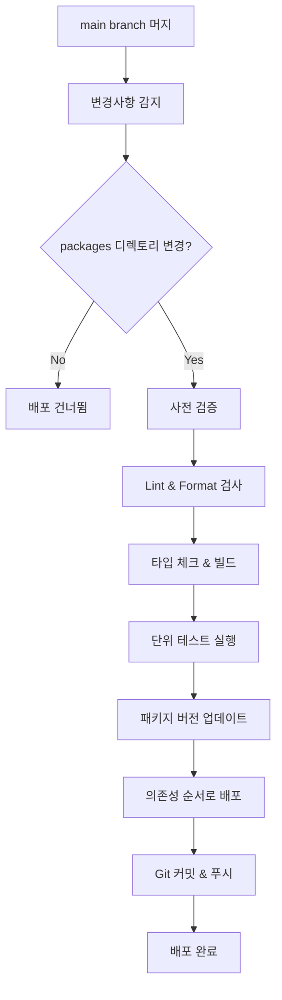

# Deployment Guide

LLM Bridge 모노레포의 자동 배포 시스템 가이드입니다.

## 📋 개요

이 프로젝트는 main branch로의 머지 시점에 변경된 패키지들을 자동으로 npm에 배포하는 CD (Continuous Deployment) 파이프라인을 제공합니다.

## 🔧 배포 시스템 구성

### 1. GitHub Actions 워크플로우

- **CI (`.github/workflows/ci.yml`)**: PR 및 push 시 코드 품질 검증
- **CD (`.github/workflows/cd.yml`)**: main branch 머지 시 자동 배포

### 2. 배포 스크립트

- **`scripts/deploy.sh`**: 실제 배포 로직을 담당하는 bash 스크립트
- 변경된 패키지 감지, 버전 관리, 빌드, npm 배포를 자동화

## 🚀 배포 프로세스

### 자동 배포 트리거

다음 상황에서 자동 배포가 실행됩니다:

1. **main branch로 PR 머지**
2. **main branch에 직접 push** (권장하지 않음)
3. **수동 워크플로우 트리거** (GitHub Actions UI에서)

### 배포 단계



## ⚙️ 설정 방법

### 1. GitHub Secrets 설정

GitHub 리포지토리 설정에서 다음 secrets을 추가해야 합니다:

```bash
# Settings > Secrets and variables > Actions > Repository secrets

NPM_TOKEN=npm_xxxxxxxxxxxxxxxxxxxxxxxxxxxxxxxxxx
```

#### NPM 토큰 생성 방법

1. [npmjs.com](https://www.npmjs.com)에 로그인
2. 프로필 > Access Tokens 메뉴 이동
3. "Generate New Token" 클릭
4. Token Type: **"Automation"** 선택
5. 생성된 토큰을 `NPM_TOKEN`으로 등록

### 2. npm 조직 설정 (선택사항)

패키지를 조직 스코프로 배포하려면:

```json
{
  "name": "@your-org/package-name",
  "publishConfig": {
    "access": "public",
    "@your-org:registry": "https://registry.npmjs.org"
  }
}
```

## 📦 패키지 배포 규칙

### 의존성 순서

배포는 다음 순서로 진행됩니다:

1. `llm-bridge-spec` (핵심 스펙)
2. `llm-bridge-loader` (로더)
3. `ollama-llm-bridge`
4. `openai-llm-bridge`
5. `bedrock-llm-bridge`
6. 기타 패키지들

### 버전 관리

- **자동 패치 버전 증가**: `1.0.0` → `1.0.1`
- **중복 배포 방지**: npm에 이미 존재하는 버전은 건너뜀
- **Git 태그 없음**: `--no-git-tag-version` 옵션 사용

### 배포 조건

다음 조건을 모두 만족해야 배포됩니다:

- ✅ `packages/` 디렉토리에 변경사항 존재
- ✅ Lint 검사 통과
- ✅ Format 검사 통과
- ✅ 타입 체크 및 빌드 성공
- ✅ 단위 테스트 통과 (E2E 제외)

## 🔍 배포 모니터링

### GitHub Actions 로그 확인

1. GitHub 리포지토리 > Actions 탭 이동
2. "CD (Continuous Deployment)" 워크플로우 선택
3. 실행 결과 및 로그 확인

### 배포 결과 요약

각 배포 완료 후 GitHub Actions Summary에서 확인 가능:

- 📅 배포 일시
- 🌿 배포 브랜치
- 📝 커밋 해시
- 📦 배포된 패키지 목록

## 🛠 수동 배포

긴급한 상황에서 수동 배포가 필요한 경우:

### 로컬에서 개별 패키지 배포

```bash
# 특정 패키지 디렉토리로 이동
cd packages/your-package

# 버전 업데이트
npm version patch

# 빌드
pnpm build

# 배포
pnpm publish --access public
```

### GitHub Actions에서 수동 트리거

1. GitHub > Actions > "CD (Continuous Deployment)"
2. "Run workflow" 버튼 클릭
3. main branch 선택 후 실행

## ⚠️ 주의사항

### 배포 제한사항

- **Private 패키지**: `"private": true`인 패키지는 배포되지 않음
- **E2E 테스트**: 배포 시 E2E 테스트는 건너뜀 (`test:ci` 사용)
- **동시 배포 방지**: 하나의 배포가 진행 중일 때 다른 배포는 대기

### 롤백 방법

배포된 패키지를 롤백해야 하는 경우:

```bash
# npm에서 특정 버전 삭제 (72시간 이내에만 가능)
npm unpublish package-name@version

# 또는 deprecate 설정
npm deprecate package-name@version "This version has been deprecated"
```

## 📚 추가 리소스

- [npm 배포 가이드](https://docs.npmjs.com/cli/v8/commands/npm-publish)
- [GitHub Actions 문서](https://docs.github.com/en/actions)
- [Semantic Versioning](https://semver.org/)

## 🆘 문제 해결

### 일반적인 문제들

1. **NPM_TOKEN 오류**

   ```
   npm ERR! 401 Unauthorized
   ```

   → GitHub Secrets에서 NPM_TOKEN 확인

2. **빌드 실패**

   ```
   npm ERR! Build failed
   ```

   → 로컬에서 `pnpm build` 테스트

3. **권한 오류**

   ```
   npm ERR! 403 Forbidden
   ```

   → npm 토큰 권한 또는 패키지 접근 권한 확인

4. **버전 충돌**
   ```
   npm ERR! Version already exists
   ```
   → 일반적으로 자동으로 건너뜀 (정상 동작)

### 로그 확인 방법

```bash
# 배포 스크립트 직접 실행 (디버깅용)
./scripts/deploy.sh

# 특정 패키지 상태 확인
npm view package-name

# 최근 배포된 버전 확인
npm view package-name versions --json
```
